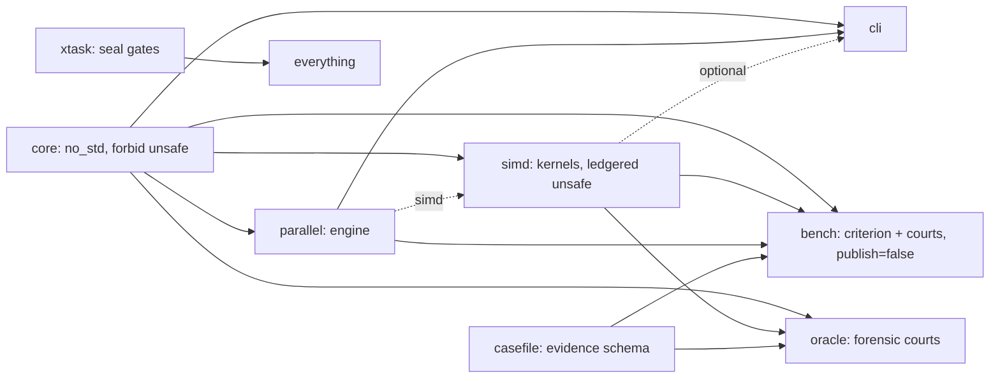

# Atlas 1 — Repository Overview

**Purpose:** the crate graph and the documentation layer map, in one view.

## Crates and dependencies

## Documentation layers (from `docs/layers.md`)

Repository → Subsystem → Algorithm → Module → Function → Section →
Operations.  Each layer explains something different; information is never
duplicated between layers.

## The evidence spine

Every crate feeds the evidence chain: core → oracle receipts; simd →
oracle + disassembly courts; parallel → Phase L courts; bench →
performance receipts; casefile → the schema; xtask → the seal.

## Reading this atlas

Start with chapters 2 and 3 (the data paths), then 8 and 9 (the engines),
then 4–7 (the lifecycles), then 10–11 (the tools).
