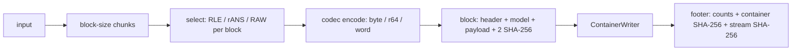

# Atlas 2 — Encoding Architecture

**Purpose:** how input bytes become a sealed `.rygr` container.

## Pipeline

## The four codecs (core crate)

byte rANS (`RANS_BYTE_L = 1<<23`, byte renorm), R64 (`RANS64_L = 1<<31`,
u32-word renorm, reciprocal multiply-high), word rANS (scale 12, 4096
slots, u16 renorm), alias (Vose table over byte rANS).  Division and
reciprocal encode paths both exist; the reciprocal path is proven equal by
Kani and the oracle.

## Block selection determinism

The encoder's per-block choice (RLE for single-symbol chunks, RAW when the
payload does not shrink, rANS otherwise) is deterministic — identical
input + options → byte-identical container.  `--always-compress` disables
the RAW fallback.

## Why encode is not SIMD-parallel at the symbol level

The encode transition is a serial dependency chain per lane; the parallel
engine parallelises *blocks*, not symbols.  Papers 0001 §6 and 0003 §8
discuss the encoder-SIMD limitation honestly.

**Related:** paper 0001 §3–§6; ADR-0001, ADR-0002; core README;
`docs/container-format-v1.md`; receipts `RYG_RANS.BYTE.*`.
