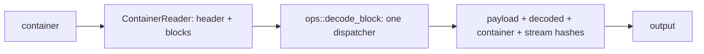
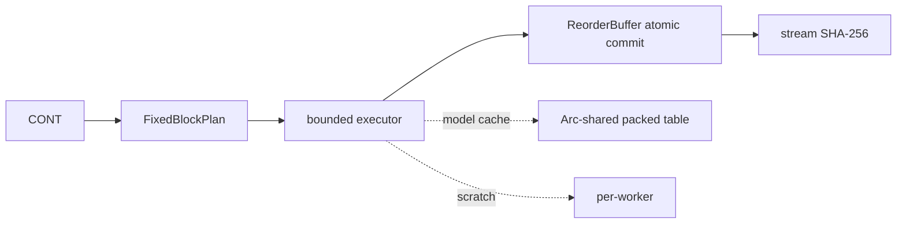

# Atlas 3 — Decoding Architecture

**Purpose:** how a container becomes verified output, scalar or parallel.

## The scalar (CLI) path

The CLI uses exactly one dispatcher for decode/inspect/verify/compare — one
truth, so a container cannot verify under one path and decode under
another.

## The parallel path

Per block: parse header → validate model → cached artifacts (freqs +
packed table) → plan (exact backend) → execute (borrowed table) → verify
decoded hash under the integrity policy.  The decoded-output hash is what
catches model corruption that payload hashing cannot.

**Related:** paper 0004; ADR-0004, ADR-0006, ADR-0007, ADR-0008, ADR-0009;
parallel README; `docs/container-format-v1.md`; courts
`RYG_RANS.L.VERIFY.DECODED_HASH`, `RYG_RANS.L.BACKEND.EXPLICIT`.
