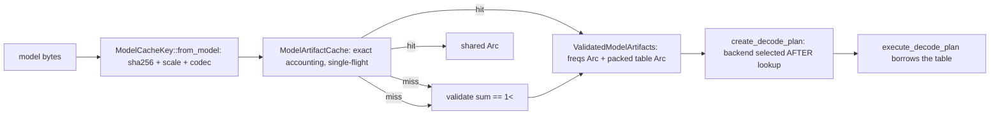

# Atlas 4 — Model Lifecycle

**Purpose:** from raw model bytes to shared decode tables.

Key design points: the cache stores only model-derived immutable artifacts
(never the backend choice); a corrupt model is never admitted; eviction is
FIFO (deterministic); caching never changes error identity.  Only the
builder may remove the in-flight single-flight marker (RACE.3, fixed
`4389d9b`); hit/miss accounting is Design A so `hits + misses == lookups`
holds under cancellation (METRICS.2).  This lifecycle is why repeated
models (grouped `ModelPolicy::External`) avoid per-block table
construction; the documented-but-inert `Uniform`/`Global` policies were
removed in Phase O (`ENCODE.MODEL_POLICY.1`).

**Related:** ADR-0009; paper 0004 §7; parallel `cache.rs`, `decode_plan.rs`;
court `RYG_RANS.L.MODEL_CACHE.INTEGRATION`.
