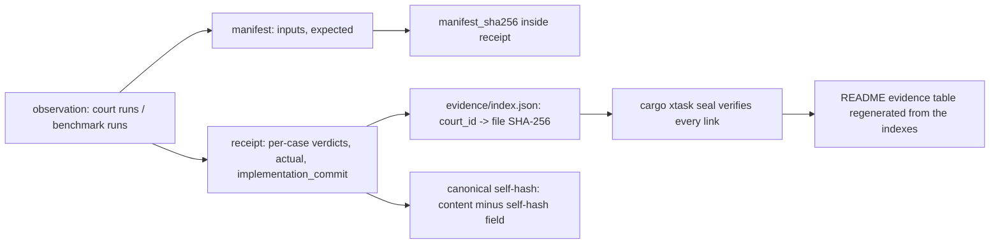

# Atlas 5 — Evidence Lifecycle

**Purpose:** how an observation becomes a sealed receipt.

The behavioural chain and the performance chain share the doctrine: values
come from execution, hashes are of real files, bindings are independent,
and the seal never prints "verified" for a skipped check (L1-R).

**Related:** paper 0006; ADR-0010; casefile README; oracle README;
`docs/residual-doctrine.md`.
