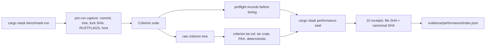

# Atlas 6 — Performance Lifecycle

**Purpose:** how a number becomes a sealed performance receipt.

A case is sealable only when full identity, preflight, hashes, thread
counts, sample counts, throughput derivation, and provenance all verify —
a zero-throughput value is valid only for a latency-unit microbenchmark
whose schema says so.

**Related:** paper 0005; ADR-0010; bench README; `evidence/performance/`.
