# Atlas 7 — Release Lifecycle

**Purpose:** from frozen implementation to published crate.

```mermaid
flowchart LR
    FREEZE[freeze covered source] --> GEN[regenerate evidence: benchmark, oracle, courts]
    GEN --> DOCKER[Docker matrix at the commit]
    DOCKER --> SEAL[full seal gate green]
    SEAL --> SEMVER[cargo semver-checks + public-api]
    SEMVER --> BUMP[version decision: patch / pre-1.0 minor]
    BUMP --> PUB[cargo publish in dependency order]
    PUB --> TAG[annotated tag at the sealed commit]
    TAG --> PUSH[push main + tag]
```

The load-bearing rule: a version bump changes Cargo.lock, which the
run-manifest binding checks — so the evidence regeneration happens at the
release version, once.

**Related:** ADR-0012; the gap ledger L22 entries; `docs/history/`.
