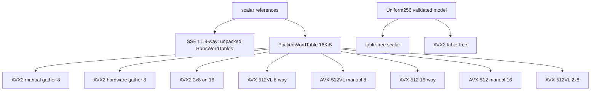

# Atlas 9 — SIMD Hierarchy

**Purpose:** the backend hierarchy and the dispatch rules.

Dispatch: portable/auto/scalar policies select scalar only; ModelAware adds
the table-free kernel for validated uniform models; explicit requests
execute exactly or return a typed error.  Runtime CPU features, compiled
features, and executed backends are recorded separately.

**Related:** papers 0002, 0003; ADR-0003, ADR-0008, ADR-0011;
`docs/unsafe-ledger.md`; receipts `RYG_RANS.SIMD.INTERLEAVED8.*`,
`RYG_RANS.AVX512VL.*`, `RYG_RANS.AVX512.*`; the disassembly courts.
