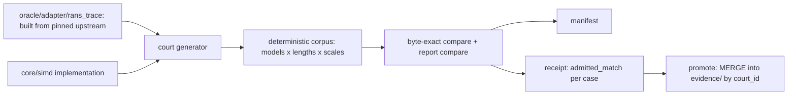

# Atlas 10 — Oracle Architecture

**Purpose:** how the C oracle pins byte-exact parity.

The promote step merges (upsert by court_id) and never replaces the tree —
the rename-and-delete scheme was a critical bug (L19-B) that destroyed
unrelated evidence.

**Related:** `docs/oracle-method.md`; paper 0007 §5; ADR-0001; oracle
README; the oracle receipts.
