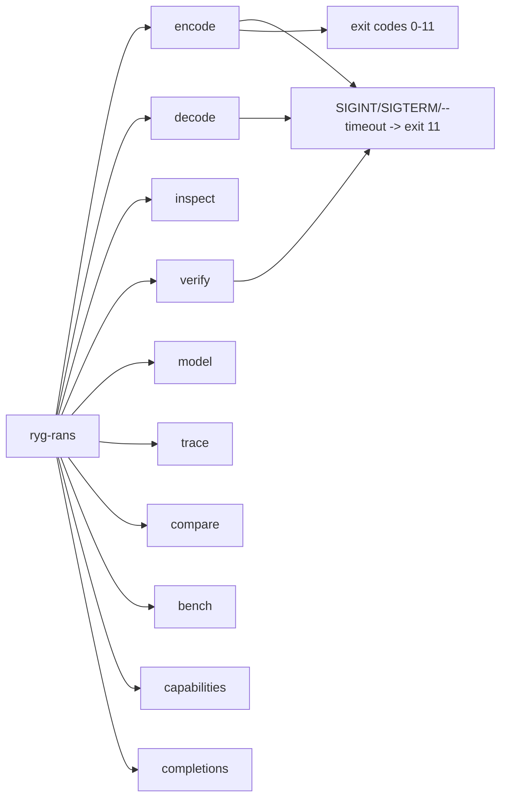

# Atlas 11 — CLI Architecture

**Purpose:** the `ryg-rans` command surface.

The container reader/writer enforce the RYGRANS v1 format; the single codec
dispatcher serves decode/inspect/verify/compare; strict integrity is the
default; the `signals` feature is the only unsafe surface (default build).

**Related:** `docs/container-format-v1.md`; ADR-0006; CLI README;
`docs/education.md` (CLI maintainer notes); the CLI integration tests.
