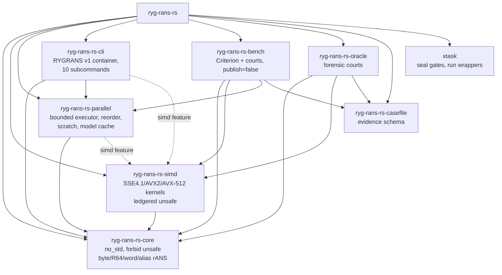
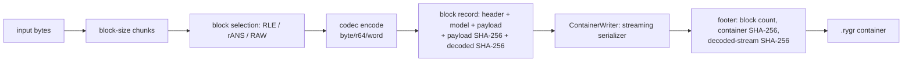
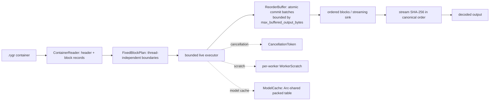
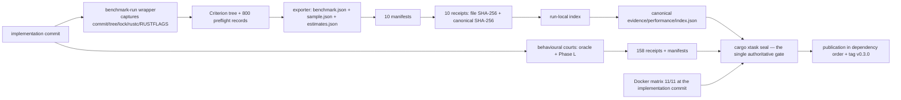
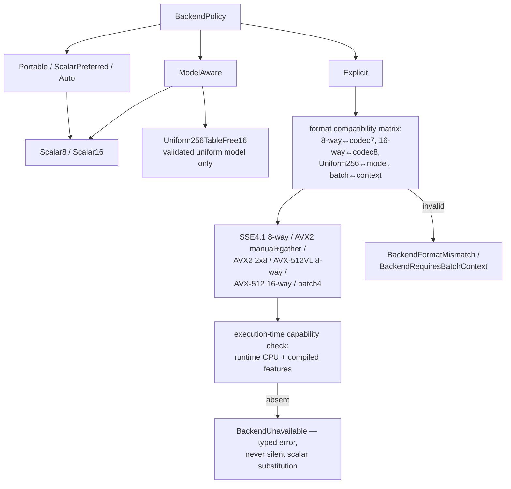
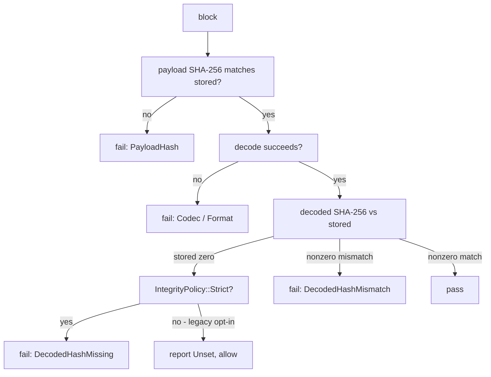
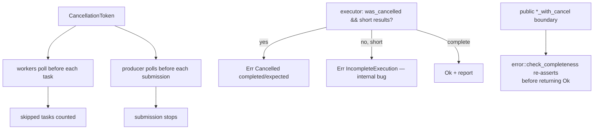
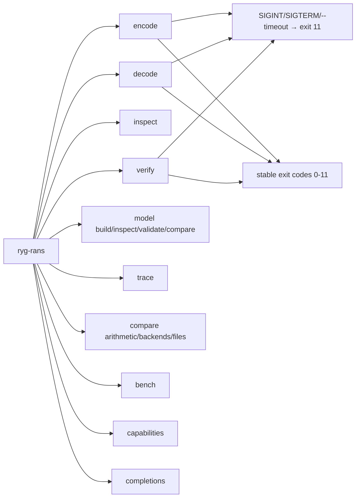
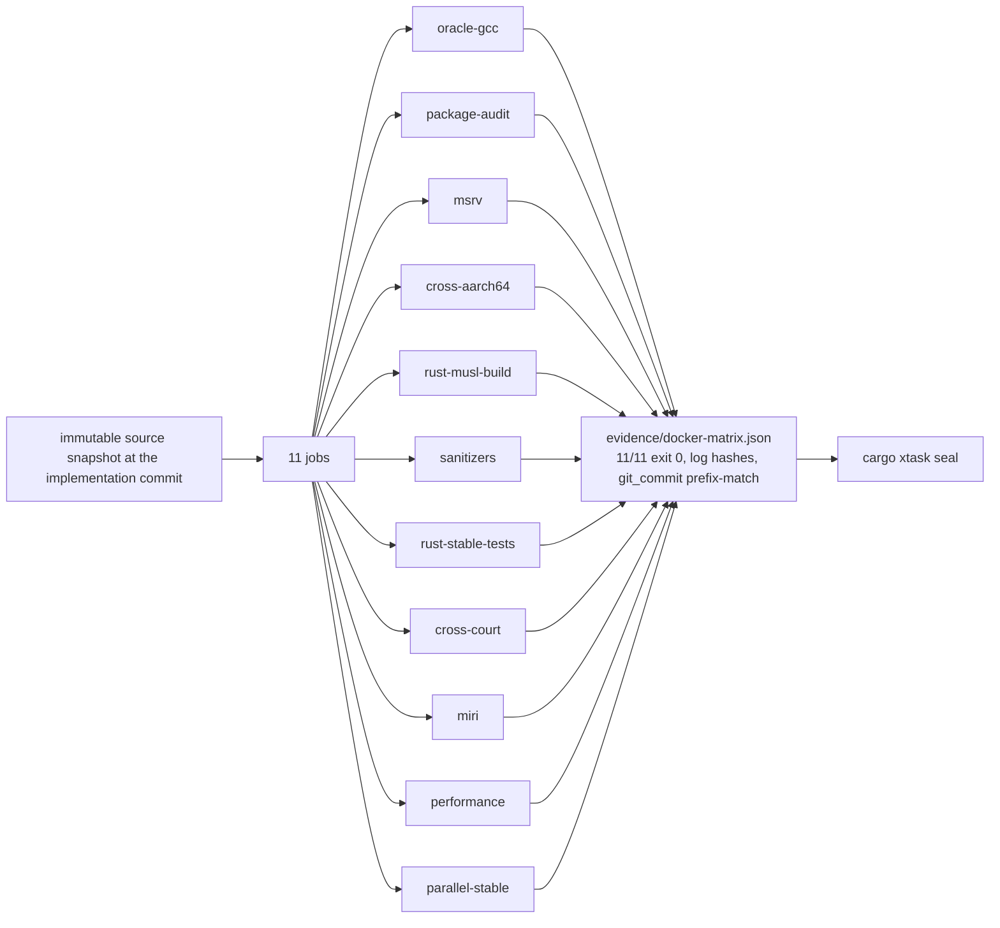

# Architecture Diagrams

> *Layer: cross-cutting (referenced by the papers and crate READMEs).  The
> diagrams are Mermaid; the renderer supports flowchart, sequence, class,
> state, ER, gantt, pie, and journey types.  Every diagram here describes
> the *actual* architecture — traced from code, not from intent.*

## 1. Repository → crates → dependencies



## 2. Encoding pipeline (CLI / container level)



## 3. Parallel decode pipeline



## 4. The bounded executor (workers, queues, cancellation, sink)

```mermaid
sequenceDiagram
    participant P as Producer thread
    participant J as Bounded job channel
    participant W as K workers (each with exclusive scratch)
    participant R as Bounded result channel
    participant C as Coordinator
    participant B as ReorderBuffer (bounded by output budget)
    P->>J: submit task (blocking send = backpressure)
    J->>W: recv task
    W->>W: run task (checks cancel; catch_unwind; reset scratch)
    W->>R: send result (blocking send = bounded in-flight)
    R->>C: recv result
    C->>B: insert → commit batch (ascending indexes)
    C->>C: drain while producer submits (no deadlock)
    Note over P,W: cancellation is polled at each yield point;
    Note over C: completeness checked at the API boundary
```

## 5. Evidence chain: implementation → receipt → seal → release



## 6. Backend dispatch



## 7. Integrity decision (per block)



## 8. Cancellation and completeness



## 9. CLI command surface



## 10. Docker matrix


