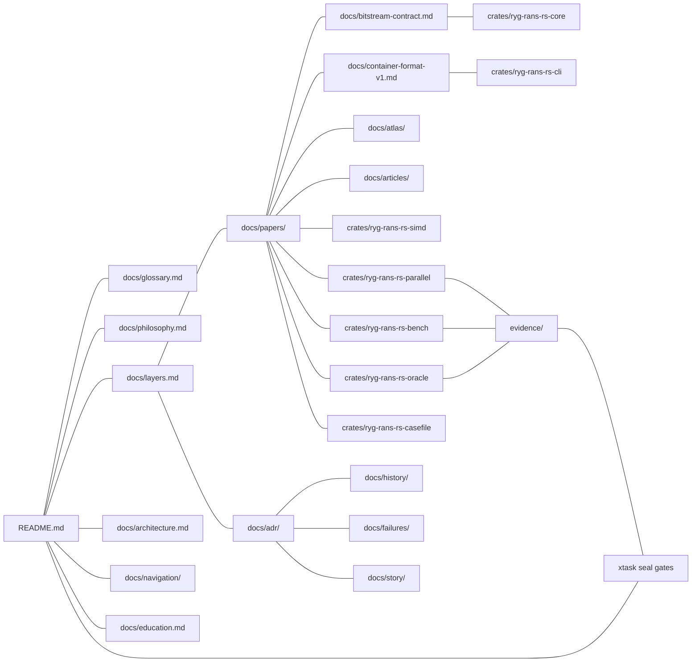

# Knowledge Graph (N.4)

> The repository's encyclopedia: every paper, ADR, subsystem, README,
> diagram, major module, receipt category, and benchmark suite, with the
> cross-references that connect them.  Use this file to navigate by topic
> instead of by directory.

## The canonical graph

## By artifact type

### Papers → what they ground

| Paper | Grounds (code) | Feeds (docs) | Receipt families |
|-------|----------------|--------------|------------------|
| 0001 rANS design | core lib.rs (byte/R64 surfaces) | bitstream-contract, articles | `RYG_RANS.BYTE.*`, `RYG_RANS.R64.*` |
| 0002 word rANS | core word surface, simd packed_table | paper 0003, atlas | `RYG_RANS.WORD.*` |
| 0003 SIMD | simd kernels | unsafe-ledger, atlas | `RYG_RANS.SIMD.INTERLEAVED8.*`, `RYG_RANS.AVX512VL.*`, `RYG_RANS.AVX512.*` |
| 0004 parallel engine | parallel crate | atlas, articles | `RYG_RANS.L.*` (engine courts) |
| 0005 performance methodology | bench crate, xtask | performance docs, articles | `RYG_RANS.PERF.*` |
| 0006 evidence | casefile, xtask, oracle | residual-doctrine | all receipts |
| 0007 proof philosophy | kani/, fuzz/, oracle | unsafe-ledger | all receipts |
| 0008 LLM-assisted engineering | the whole repository | llm/, story | the gap ledger |

### ADRs → what they decide

| ADR | Topic group | Affects |
|-----|-------------|---------|
| 0001 format contract | Architecture | core, bitstream-contract |
| 0002 reciprocal fast path | Performance | core encode paths |
| 0003 word scale pinned | SIMD | simd packed table |
| 0004 bounded live executor | Parallel | parallel executor |
| 0005 canonical error | Parallel | parallel error.rs |
| 0006 strict integrity | Safety | parallel config, CLI verify |
| 0007 completeness boundary | Parallel | all `*_with_cancel` APIs |
| 0008 exact backends | Architecture | decode_plan.rs |
| 0009 model cache artifact | Performance | parallel cache.rs |
| 0010 benchmark-time capture | Evidence | xtask benchmark-run |
| 0011 unsafe quarantine | Safety | simd crate, ledger |
| 0012 versioning 030 | Release | Cargo.toml, evidence |
| 0013 configuration discipline | Configuration | parallel config.rs |
| 0014 reorder atomic commit | Parallel | parallel reorder.rs |
| 0015 per-worker scratch | Parallel | parallel scratch.rs |

### Subsystems → their documentation set

| Subsystem | Crate README | Paper | ADR | Atlas chapter | Receipts |
|-----------|--------------|-------|-----|---------------|----------|
| core | core/README | 0001, 0002, 0007 | 0001, 0002 | atlas-encoding | `BYTE`, `R64`, `WORD`, `ALIAS` |
| simd | simd/README | 0002, 0003 | 0003, 0011 | atlas-simd | `SIMD.INTERLEAVED8`, `AVX512*` |
| parallel | parallel/README | 0004 | 0004-0009, 0013-0015 | atlas-parallel | `RYG_RANS.L.*` |
| cli | cli/README | 0001, 0006 | 0006 | atlas-cli | CLI courts |
| bench | bench/README | 0005 | 0010 | atlas-performance | `RYG_RANS.PERF.*` |
| oracle | oracle/README | 0006, 0007 | 0001 | atlas-oracle | oracle courts |
| casefile | casefile/README | 0006 | — | atlas-evidence | all |
| xtask | xtask/README | 0005, 0006 | 0010 | atlas-evidence | seal gates |

### Receipt categories → their meaning

| Category | Meaning | Where generated |
|----------|---------|-----------------|
| `RYG_RANS.BYTE.*` | byte rANS oracle parity | oracle main.rs |
| `RYG_RANS.R64.*` | R64 oracle parity | oracle main.rs |
| `RYG_RANS.WORD.*` | word coder oracle parity | oracle main.rs |
| `RYG_RANS.ALIAS.*` | alias surface oracle parity | oracle main.rs |
| `RYG_RANS.SIMD.INTERLEAVED8.*` | SSE4.1 8-way oracle parity | oracle main.rs |
| `RYG_RANS.AVX512VL.*` | AVX-512VL 8-way oracle parity | oracle run-phase-g |
| `RYG_RANS.AVX512.*` | AVX-512 16-way oracle parity | oracle run-phase-g |
| `RYG_RANS.L.*` | Phase L behavioural courts | bench courts-run |
| `RYG_RANS.PERF.*` | the ten sealed performance surfaces | xtask performance-seal |

### Diagrams → what they depict

`docs/diagrams/index.md`: repository/crates (1), encode pipeline (2),
parallel decode (3), executor sequence (4), evidence chain (5), backend
dispatch (6), integrity decision (7), cancellation (8), CLI surface (9),
Docker matrix (10).

### Navigation → the entry layer

`docs/navigation/`: `inventory.md` (N.0), `00..10` guides (N.1),
`maps/` (N.2), `knowledge-graph.md` (this file), `adrs-by-topic.md`
(N.9), `reading-paths.md` (N.13), `commentary.md` (N.11), `search/`
indexes (N.15).

### Articles → the outward-facing layer

`docs/articles/` — six standalone engineering papers (N.6), each
independently readable.

### Failures and story → the historical layer

`docs/failures/` — the failure encyclopedia (N.10).
`docs/story/` — the engineering story (N.8).
`docs/history/` — the chronology (N.7).

## Traversal rules

1. **Enter** at the README portal or a navigation guide.
2. **Understand** via a paper or article.
3. **Decide** via an ADR.
4. **Verify** via a receipt or a seal gate.
5. **Deepen** via the atlas, the module commentary, or the source.
6. **Learn from the past** via the history, failures, and story.

No artifact is isolated: each links to its related papers, ADRs, code,
receipts, benchmarks, history, and diagrams (N.12), and the documentation
seal fails if any required link is missing (N.14/N.21).
