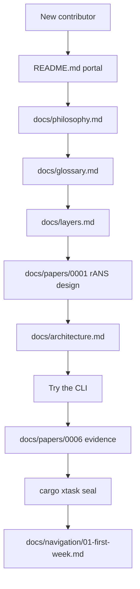
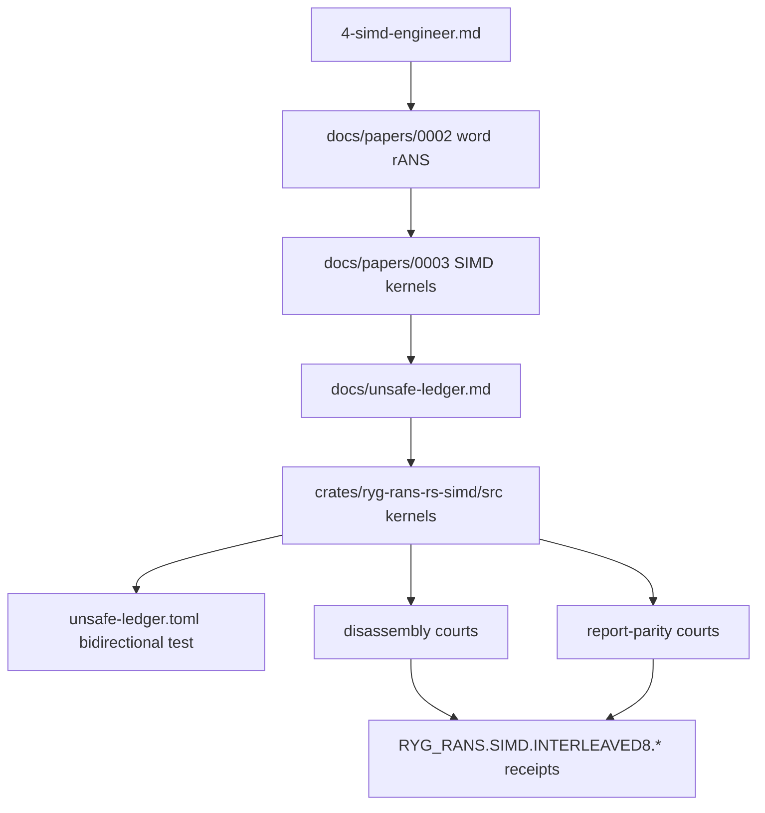
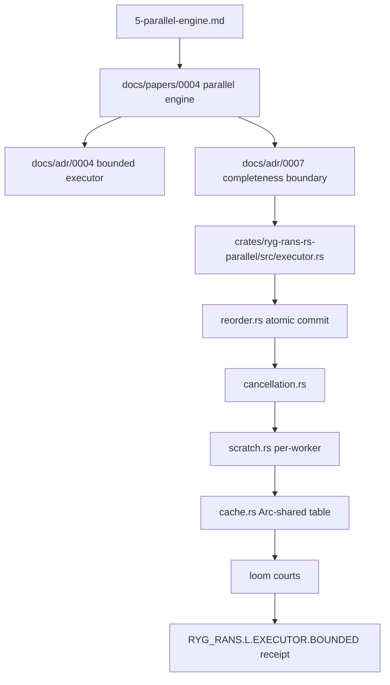
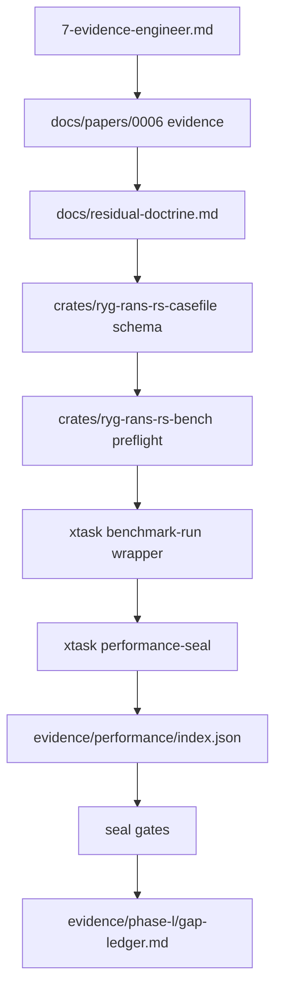
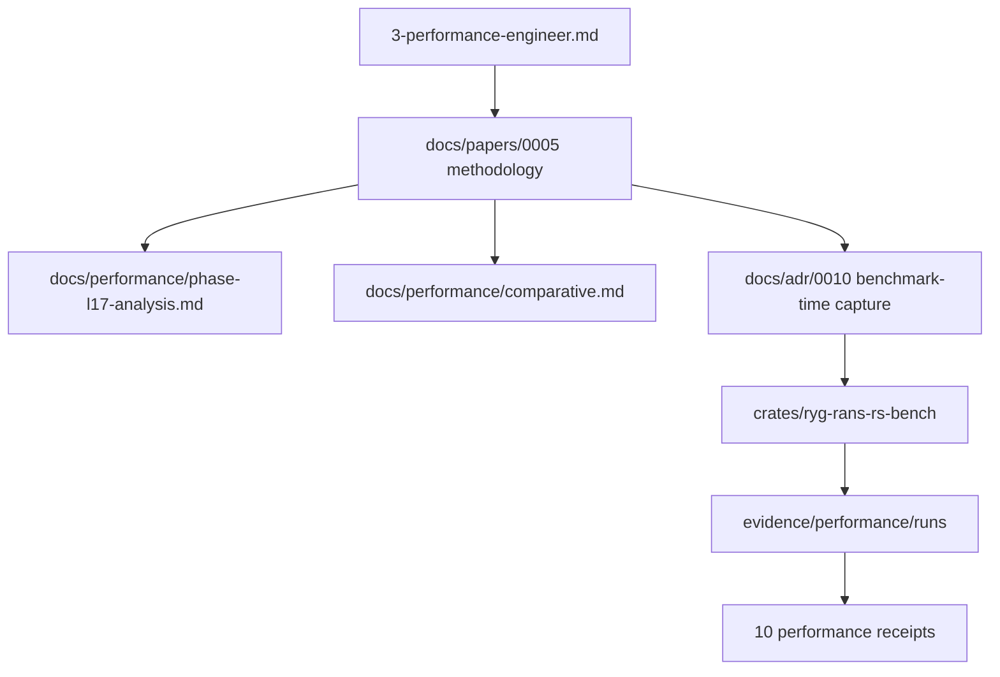
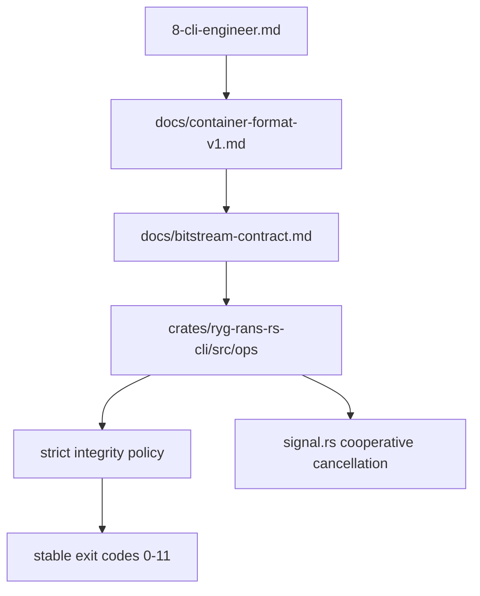
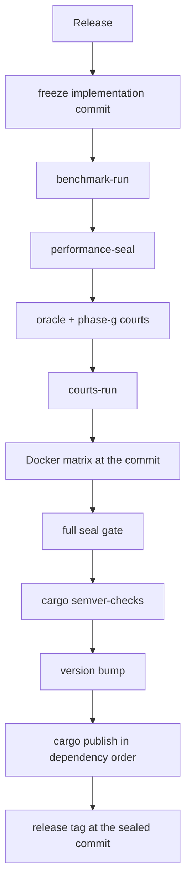
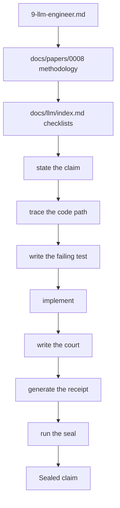

# Learning Maps (N.2)

> Dependency maps for the major learning paths.  Each map exists as Mermaid
> below and as an SVG in this directory (`maps/*.svg`).  The maps show
> dependencies, not a strict timetable — follow the arrows.

## 1. New contributor

## 2. SIMD

## 3. Parallel engine

## 4. Evidence

## 5. Performance

## 6. Container / CLI

## 7. Release

## 8. LLM workflow

